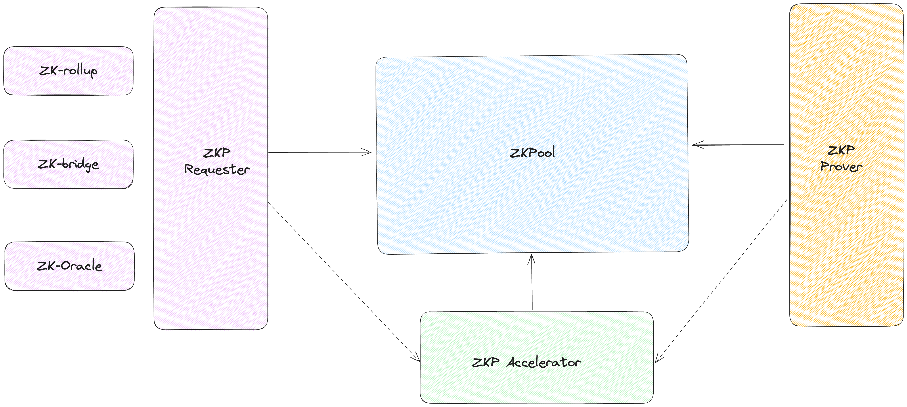
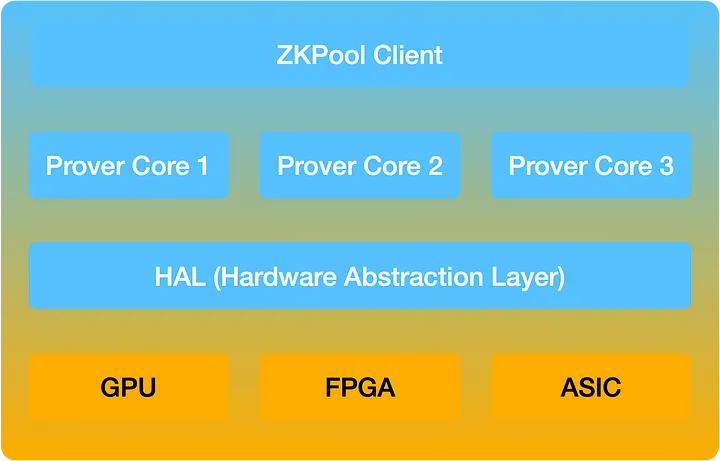

# Introduction

ZKPool is an open and permissionless platform that connects various ZKP projects and provers, offering multiple capabilities:

- ZKPool aggregates the capacities of smaller provers and acts as a super prover proxy, providing necessary stake to ZKP projects.
- ZKPool offers competitive price to win the proof tasks and minimize the risks of being slashed.
- ZKPool distributes the rewards among provers and the other participants.
- ZKPool simplifies the process of joining for both provers and ZKP projects.

# The Ecosystem of ZKPool
The participants in ZKPool include:
1. ZKP Requester: Refers to ZKP projects that require ZKP proofs.
2. ZKP Prover: Operators who own the hardware and run the provers.
3. ZKP Accelerator: A team that provides accelerated software implementation for certain ZKP projects.

It's noted that the ZKP requester can also be a ZKP accelerator. For instance, a ZKP project might have its own best GPU-accelerated software.

Similarly, the ZKP prover can also act as a ZKP accelerator. For example, ZKP prover operators may develop their own accelerated software.

The ecosystem is represented in the following diagram:

# Two-tier ZKP proving tokenomics
Currently, many ZKP projects utilize their own proving systems and tokenomics. To establish a healthier and more cost-effective ZKP proving ecosystem, a two-tier proving tokenomics model can be a viable solution. Taiko proposed a solution after several iterations of proving tokenomics, which we have further extended to a two-tier framework.

Under this approach, each ZKP project functions as tier 1, defining its own tokenomics. However, the tasks of selection, scheduling, penalties, rewards, and rating of provers are delegated to tier 2, which operates as a shared prover pool.

The scope of the two tiers is as follows:

|  | Tier 1 (ZKP projects)  | Tier 2 (ZKPool) |
| --- | --- | --- |
| Scope | • Publish proof task.  • Establish rewards and penalties.  • Define key metrics such as proof window. | • Aggregate proof task.  • Schedule and rate prover resources.  • Distribute rewards.  • Assume penalty risk.  • Define price competition strategy. |

# UMP (Universal Modular Prover)
ZKPool utilizes Universal Modular Prover (UMP) to integrate various provers.

A UMP can operate on the same hardware platform while supporting the proving works of various ZKP projects.

