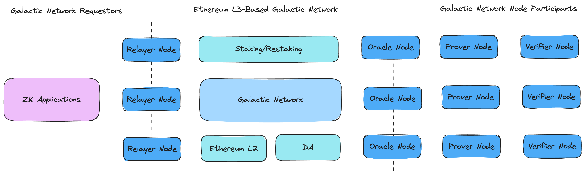

# Galactic-Network-introduction
We refer to ZKPool-2.0 as the [Galactic Network](https://en.wikipedia.org/wiki/Intergalactic_Computer_Network) in tribute to J.C.R. Licklider, who first proposed the Galactic Network concept, an early vision of the open internet.

## Background

- Verifiable computation, specifically Zero-knowledge proof (ZKPs) technology, serves as a cornerstone in the crypto world. However, designing and operating a reliable, low-cost, decentralized, and economically healthy proving network can be very challenging.
- As Vitalik mentioned[1][2], the zkEVM might have bugs. For better security, a multi-provers framework has been proposed, and increasingly more projects, like Taiko, Scroll etc. are adopting this solution. Such a design will make the network more complex.
- ZKP requires a significant amount of computational power. However, it's crucial to understand that, unlike the POW project, these requirements are dynamic, not constant. For instance, the total number of transactions in a rollup may fluctuate, and some ZKP projects operate in optimism mode, requiring ZKP only at specific times. Therefore, in each independent ZKP network, the use of ZKP accelerators may vary, increasing the overall cost. Sharing the proving network is essential for fully utilizing the vital computational power.

## Galactic Network

The Galactic network aims to create a modular Verifiable Computation Layer (MVCL) that is affordable, decentralized, and easily accessible. This network will significantly reduce the development cost for ZKP (Zero-Knowledge Proof) projects' developers. 

Ethereum also plans to use ZKP to verify Layer 1. Vitalik proposed the "Enshrined ZKEVM" to allow L1 and L2 to share the ZKEVM prover[3]. A modular verifiable computation layer will be aligned with Ethereum's long-term vision.

Additionally, it supports not only the Ethereum ZKP proving network but also other types of verifiable computation, including the Bitcoin ecosystem, web2 verifiable computation scenarios, and so on.

The Galactic network comprises the following components:

- Ethereum L3 based Appchain: A decentralized, permissionless network constructed to support protocols for provers, verifiers, and more to schedule the proving/verification tasks and distribute rewards.
- Galactic prover node: Nodes responsible for generating proofs.
- Galactic verification node: Nodes that handle verifications.
- Galactic relayer node: Nodes to relay proving tasks from ZKP projects to the Galactic network.
- Galactic oracle node: Nodes to split and schedule proving and verification tasks, and aggregate multi-provers.

This network offers several unique features:

- Low-cost and high-performance
- Support for multiple ZKP provers.
- Support for a POS-based verifier.

ZKP accelerators can participate in ZKP-proving tasks, which effectively boosts the utilization rate of their accelerators. Meanwhile, the verifier can aid in the validation of these proofs.