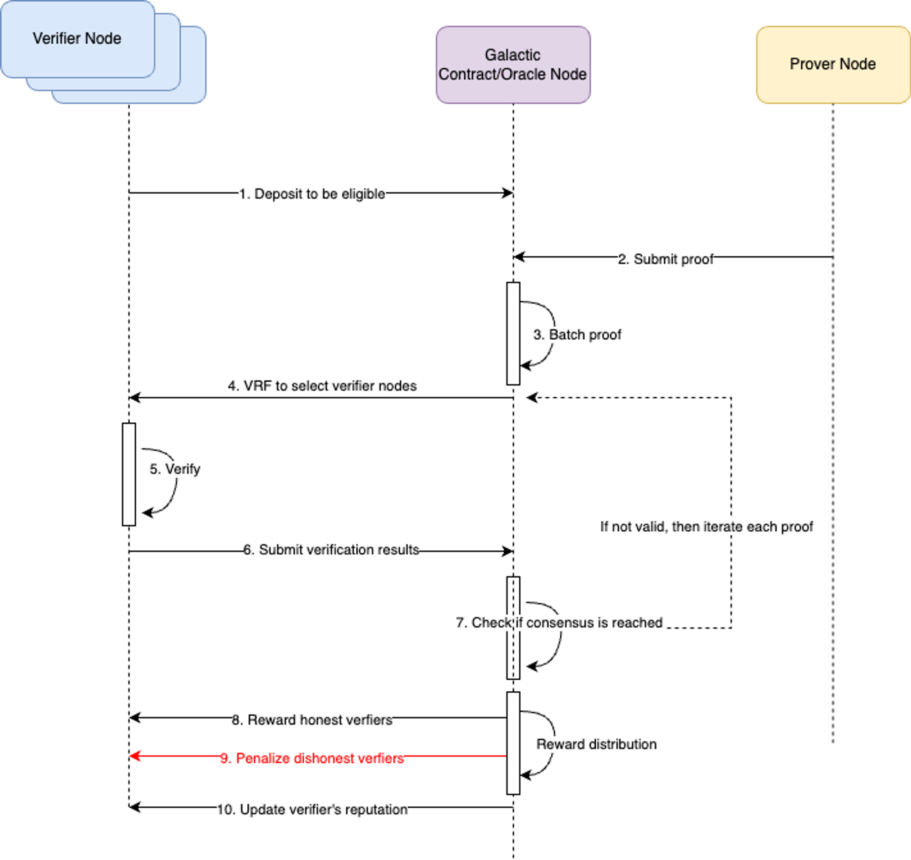

# PoS-Based Verifiers

Proofs need to be verified within the network before being sent back or retrieved by the requester for the following reasons:

1. If a proof is invalid, the network can reassign the task to another prover.
2. Rewards are only distributed to provers who produce valid proofs.
3. Verifying proofs enhances the network's trustworthiness.

A decentralized network of verifier nodes will be established to reach a consensus on proof settlement. A node offers greater flexibility than a verifier contract because not all projects have a Solidity version of verification code. Verifying the batched proof can further reduce the cost. The mechanism will resemble Ethereum's proof of stake but likely in a simpler form. The process is as follows:

*PoS-Based Verifiers Flow*

1. ZK projects supply the verifier code, which can be in different languages.
2. Either the ZK project or the community operates one or more verifier nodes.
3. To ensure the verifier's good intentions, a minimal deposit is required as staking asset.
4. Galactic contract or Oracle node aggregates proofs and produce an batchedProof
5. The Galactic contract or Oracle node uses a VRF to select a committee of verifier nodes for the batchedProof.
6. The verifier nodes carry out the proof verification and submit their results to the Galactic contract or Oracle node within a specified timeframe.
7. If a majority of the committee (for example, 2/3) reach a consensus, and if correct, all proofs in the batched proof are considered verified as either valid, if not then iterate to verify each proof.
8. Honest verifier nodes are equally rewarded, while dishonest ones are penalized.
9. The verifier's reputation is updated based on their actions.

We choose a verifier network over a DAO which handles challenges in an optimistic manner for the following reasons:

1. ZK verification is quick and cost-effective.
2. Verification consensus can be achieved rapidly because it depends on the L3 block proposing speed, which can be significantly fast.
3. It takes longer for a DAO to settle a proof if a challenge arises.
4. In both scenarios, verification codes from various ZK projects are required.

However, if there's a conflict between the PoS-Based verification results and the requestors' verification results, we'll need the governance DAO to handle such an issue.

Additionally, using an existing platform like EigenLayer is an option for us.