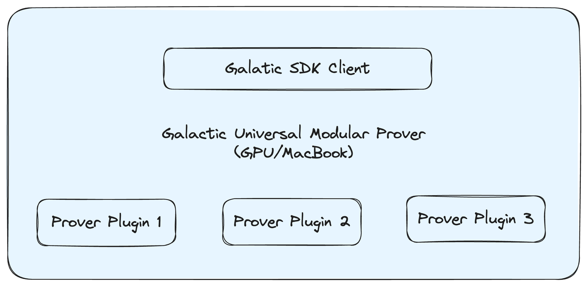
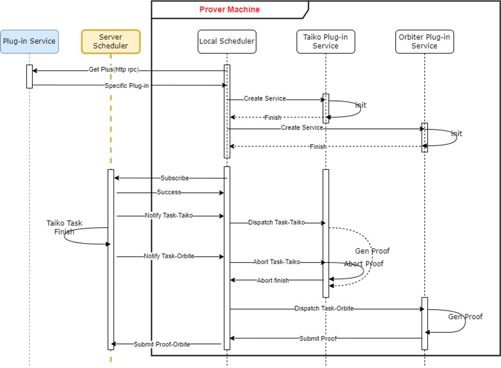

# Graph-Based Computation Tasks Scheduling
## ZKP Proving Task Description

In AI, like TensorFlow, we will use graphs to describe the computation. In the graph, there are many operations, such as conv, pooling, and so on. 

In ZKP, we also have similar requirements, because:

1. For ZKVM, the continuation technology will split the big proving tasks into smaller ones. 
2. The recursion/composition/aggregation technology is widely used.

*Proof Composition (Source: Figment Capital)*

For each zkp proving task, we can define it as a kind of operation of a computation graph. Each device works as a computation node to finish the part of the proving tasks.

Thus, we can use a graph to describe the overall proving tasks. 

*Graph-Based Computation*

For each operation, we can define these properties:

- input operation (null, one input or multiple inputs)
- name: (support customization)
    - “zkp-singleton"
    - “zkp-continuation”
    - “zkp-recursion-A”
    - “zkp-recursion-B”
    - “zkp-aggregation”
    - ……
- device requirements
    - OS type
    - CPU requirements
    - GPU requirements
    - Memory requirements
- devices id (null when it’s not assigned)
- output operation

## Scheduler

We will use Oracle Node to take the role of scheduling.

Oracle node will receive the status of all the connected provers and record its liveness and busy/idle status. Once a new task is published, the scheduler will start to work.

Here, we define a task-node matching mechanism.

Firstly, after analyzing a computation graph, a 

- Descriptor of tasks (optimized binary related)
    - Graph
    - Task mode:
        - Performance priority: Redundancy of provers
        - Cost priority: Only one prover for each operation.
- Descriptor of device
    - OS type
    - CPU type
    - GPU type
    - Memory

Then we we find a candidate device list for each operation. 

If there is more than one candidate for each operation, we will choose a device according to its reputation and random mechanism.

1. A random number in [1, 100] is generated as R
2. Assume all the reputation scores of candidate devices are: [s1, s2…si……sn]
3. Normalize all the reputations as si’=si*100/sum(s1…sn), and the new vector is [s1’, s2’…si’……sn’]
4. Compare R with sum(s1’…si’), if the sum is greater than R, then we choose device i.

When we need more than one device, and then we will exclude the assigned device and use the above method to choose the other devices.

Finally, we will fill in the device id for each operation of the computation graph.

## Galactic Universal Modular Prover

The UMP means each ZKP accelerator can support different kinds of ZKP proving tasks.

*Universal Modular Prover*

The Oracle node features a plug-in service. This allows provers to connect and determine the types of tasks the prover can manage. The corresponding proving binary Docker is then downloaded, enabling the node to handle such tasks.

In this manner, a single accelerator can support multiple ZKP proving binaries.

*Universal Modular Prover Flow*

The local scheduler/Galactic SDK connects to the proving binary plugin via RPC call.

The protocol includes:

1. init 
2. start computation
3. stop

A mechanism to trigger different kinds of computation.

The computation node has two modes: 

- high-efficient mode (default mode): The computation service is restarted each time.  It can easily switch among different tasks.
- high-performance mode: The computation service stays in the memory, and when a new task comes, it doesn’t need to restart the service. It’s used for high throughput tasks.

Each kind of requester project can define its ideal mode.

## Power of Computation

The platform’s incentives are measured by the Power of Computation. Without accurate computation power measurement, we can’t effectively incentivize the devices.

For GPU, we will use the real amount of OP to benchmark its contribution similar to Nsight Compute tools.

For any GPU, the most important acceleration engine is cuda cores or tensor cores. The ZKP usually uses CUDA to accelerate and the AI uses tensor core to accelerate.

A benchmark will be used to measure the computation amount required by some tasks.

We will define different computations of Galactic-gas, such as:

- tensor core: xx gas/TOPs
- cuda core:  xx gas/TOPs