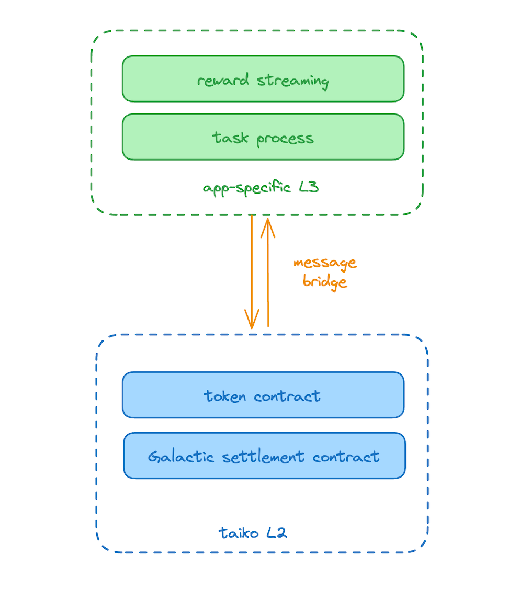
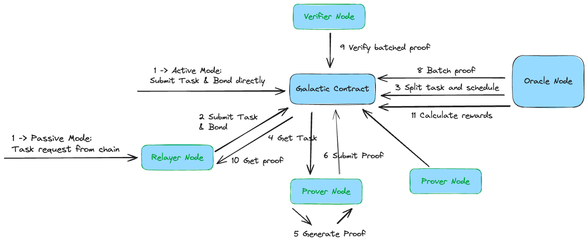

# Modular Galactic Network Overview
## Ethereum L3-Based Appchain

We anticipate the network will have high-performance requirements due to the frequent chain interactions and token transactions associated with the lifecycle of proof tasks. As such, cost is a significant consideration.

To reduce the overall cost, we plan to deploy our protocol layer on an Ethereum L3 Appchain, which is an L2 of another L2 rollup. This approach offers the following advantages:

1. Compatibility with the Ethereum ecosystem
2. Low transaction fees, essential for the numerous interactions with smart contracts
3. Customizable block proposing speed, for instance, every 1 second, and block finalization frequency, such as every 1 minute, to further reduce costs
4. Its own ecosystem, including bridge, DEX, etc., which could potentially expand in the future
5. Decentralization

We will start with the Taiko chain and consider other chains as a backup.

Taiko enables for setting the ratio between optimistic proofs (no ZK computation) and ZK proofs (which require ZK computation) of blocks, significantly reducing the costs. We will also batch  blocks to decrease the transaction fee of settling block data into L2. Furthermore, we will consider using a Data Availability Layer to reduce the cost of writing data to L2.

However, we will not compromise on security. The protocol's main contract and token contract will be deployed on Taiko L2, which are used to settle the protocol's vault and reward pool. Using Taiko's built-in cross-chain messaging infrastructure, we can seamlessly transfer funds from Galactic Network’s protocol layer to L2. Storing funds on L2 is safer as it is more decentralized compared to our protocol layer, which is more application-specific.

On our protocol layer, we will deploy contract logic that is operated frequently, such as the circulation of proof fees, streaming payment, and the lifecycle of proving tasks. This will help maintain a low overall cost, allowing network users to concentrate on their tasks without worrying about the cost of network transactions.
  
 *Ethereum L3-Based Appchain*

L2 is an extension of Ethereum's performance, while L3 amplifies L2's capabilities. We estimate that app-specific L3 could have a gas limit of 0.5-1B, which is equivalent to each block containing 1000 ERC20 transfers. Furthermore, it could achieve sub-second block speeds. In summary, it could reach 1000-5000 transactions per second (tps) or higher.

The primary transaction cost of L3 is the block data storage written to L2. On average, each L3 transaction consumes 2000-3000 L2 gas. At a throughput of 1000 tps, this would consume 0.002 ETH at an L2 gas price of 1 gwei. Therefore, using L2 as the data availability layer could incur higer costs. Our preference is to utilize other dedicated data availability layers, such as Celestia, EigenDA, or Avail. According to our [calculations](https://medium.com/@numia.data/the-impact-of-celestias-modular-da-layer-on-ethereum-l2s-a-first-look-8321bd41ff25), this approach could reduce costs by approximately 300 to 500 times, rendering them virtually negligible. 

## Galactic Network Modules

The Galactic contract will act as the central hub for essential network records, including projects, provers, tasks, rewards, bonds, and staking, among others. This will be the foundation for the entire decentralized network.

The Oracle node, an integral part of the network, will handle complex task scheduling, reward distribution, and proof aggregation.

Prover, relayer, and verifier nodes will all function in a decentralized manner externally, relaying on the Galactic contract as their source of truth.

 
 *Galactic Network Modules*

### What does the Galactic Contract contain?

 
 *Galactic Contracts*

1. Task events for actions: submission, proof, and verification.
2. Projects, provers, verifiers and tasks.
3. Provers' rewards: these are updated periodically, for instance, daily.
4. The default reward calculation is conducted on-chain.
5. Provers' bonds.
6. Users' staking.

### What does the Oracle Node contain?

 
 *Galactic Oracle nodes*

1. Task scheduling involves complex logic. The final task scheduling results are written to the Galactic contract, while intermediate task statuses are stored in the local database. Given the substantial volume of task data, which could potentially overload the contract, only the most necessary data are written to the chain.
2. Task split and aggregation: A task might be divided into multiple smaller subtasks and proved in parallel to increase efficiency.
3. Proof aggregation: generate a batched proof for a group of proofs
4. Complex reward calculation can be performed off-chain if the default version in the Galactic contract is unable to handle it or if the process involves too many steps.

### What does the Relayer Node do?

A relayer node acts as an external node that integrates with ZKP projects by retrieving active tasks from these projects.

Meanwhile, the relayer node needs to pay the gas fee and provide the necessary staking token for the ZKP projects if required by the projects.

### What’s the task flow?
Here are the detailed modules relationship and a sequence diagram:

 *Galactic Network modules relationship*

*Galactic Network Flow Sequence*

The steps are as follows:
1. The task request is directly submitted to the Galactic contract (Active mode).
    
    Alternatively, in Passive mode (as shown in the diagram above), the relayer retrieves the task from another chain and then submits the task, along with the bond, to the Galactic contract. The task should be described as a computation graph.
    
2. The Galactic contract publishes the proving task. The oracle node then retrieves task information from the contract, schedules the task based on the computation graph and the prover's attributes and availability, and sends the scheduled result back to the contract.
3. The Galactic contract publishes the scheduled results, enabling each prover to determine whether they have been selected to join the task.
4. The prover node syncs the task from the Galactic contract, generates the proof, and sends it back to the Oracle contract.
5. An Oracle node monitors the Oracle contract. Plans are in place for an Oracle node to initiate an aggregation proof task, after which the verifiers will only need to verify the aggregated proof.
6. An Oracle node schedules the verifiers to perform the verification and notifies the Galactic contract.
7. The Galactic contract publishes the verifier task. The selected verifiers monitor this and begin the verification process.
8. The verifier returns the verification result to the contract. Once the Galactic contract determines that the majority of verification results pass, it marks the proof as verified.
9. The Galactic Oracle calculates the reward. (This logic may be transferred to the contract later.)
10. The Galactic contract then returns the bond and distributes the reward between the prover and the verifiers, with the verifiers receiving a portion of the reward.

In the architecture described above, there will be numerous interactions between various parties and the Galactic contract. This informs our decision to choose Ethereum L3, which will further reduce transaction costs.
